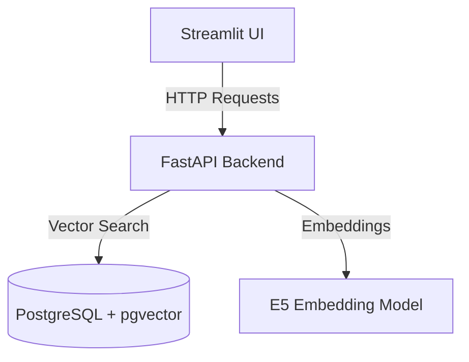

# RAG Search Application - High Level Design

## Overview
This application is a Retrieval-Augmented Generation (RAG) search system that allows users to search through vectorized document chunks using semantic similarity. The system consists of three main components: a UI service, a backend API service, and a PostgreSQL database with vector search capabilities.

## System Architecture

## Core Components

### 1. UI Service (Streamlit)
- **Purpose**: Provides user interface for document search and result display
- **Key Features**:
  - Chat-like interface for queries
  - Expandable search results with source attribution
  - Embedding count display
  - Relevance scoring display

### 2. Backend Service (FastAPI)
- **Purpose**: Handles document processing and vector search operations
- **Key Features**:
  - PDF text extraction
  - Text chunking
  - Vector embedding generation
  - Semantic similarity search
  - Document metadata management

### 3. Database (PostgreSQL + pgvector)
- **Purpose**: Stores and indexes document chunks and their vector embeddings
- **Key Features**:
  - Vector similarity search
  - Document text storage
  - Source attribution storage
  - Metadata storage

## Key Workflows

### 1. Document Ingestion
1. User submits PDF URL
2. Backend downloads and extracts text
3. Text is split into chunks
4. Each chunk is converted to vector embedding
5. Chunks and embeddings are stored in database with source attribution

### 2. Semantic Search
1. User enters search query
2. Query is converted to vector embedding
3. Vector similarity search finds relevant chunks
4. Results are filtered by similarity threshold
5. Relevant chunks are displayed with source attribution

## Technical Details

### Vector Embedding
- **Model**: E5-small-v2 (384 dimensions)
- **Chunking**: 510 tokens with 50 token overlap
- **Similarity Metric**: Cosine similarity

### Data Storage
- **Vector Type**: 384-dimensional vectors (E5)
- **Metadata**: Source document URL, text content, similarity scores
- **Indexing**: pgvector for efficient similarity search

### API Endpoints
- `/ingest/pdf`: Document ingestion
- `/search/text`: Semantic search
- `/admin/table-counts`: System statistics
- `/admin/embeddings`: Database management

## Deployment

The application is containerized using Docker with three services:
- UI container (port 8501)
- Backend container (port 8000)
- PostgreSQL container (port 5432)

All services are orchestrated using Docker Compose for easy deployment and scaling.

## Future Improvements
- Batch document processing
- Additional document format support
- Advanced filtering options
- User authentication
- Result caching
- Concurrent request handling optimization 